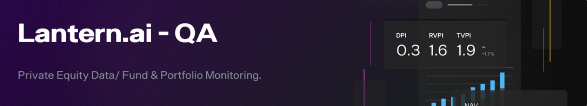

<!-- Improved compatibility of back to top link: See: https://github.com/othneildrew/Best-README-Template/pull/73 -->
<a name="readme-top"></a>

<!-- PROJECT SHIELDS -->
<!--
*** Reference links for the badges
-->
<!-- [![LinkedIn][linkedin-shield]][linkedin-url] -->

<!-- PROJECT LOGO -->
<br />
<div align="center">
  <a href="https://github.com/lantern-wilson/E2E-LanternAuto">
    
  </a>

  <h3 align="center">E2E LanternAuto - 🎭 Playwright </h3>

  <p align="center">
    A comprehensive Playwright setup for End-to-End automation testing!
    <br />
    <a href="https://github.com/lantern-wilson/E2E-LanternAuto"><strong>Explore the docs »</strong></a>
    <br />
    <br />
    <a href="https://github.com/lantern-wilson/E2E-LanternAuto">View Demo</a>
    ·
    <a href="https://github.com/lantern-wilson/E2E-LanternAuto/issues">Report Bug</a>
    ·
    <a href="https://github.com/lantern-wilson/E2E-LanternAuto/issues">Request Feature</a>
  </p>
</div>

<!-- TABLE OF CONTENTS -->
<details>
  <summary>Table of Contents</summary>
  <ol>
    <li><a href="#about-the-project">About The Project</a></li>
    <li>
      <a href="#getting-started">Getting Started</a>
      <ul>
        <li><a href="#prerequisites">Prerequisites</a></li>
        <li><a href="#installation">Installation</a></li>
      </ul>
    </li>
    <li><a href="#usage">Usage</a></li>
    <li><a href="#license">License</a></li>
    <li><a href="#contact">Contact</a></li>
    <li><a href="#acknowledgments">Acknowledgments</a></li>
  </ol>
</details>

<!-- ABOUT THE PROJECT -->
## About The Project



E2E LanternAuto is a Playwright-based project designed to facilitate comprehensive end-to-end testing. This project aims to provide a streamlined setup for automating the lantern regression pack over on the TestRail Test management platform, this will enable more efficient and effective testing strategies.

### Built With
[![JavaScript][JavaScript.shield]][JavaScript-url] [![Playwright][Playwright.dev]][Playwright-url]


<!-- MARKDOWN LINKS & IMAGES -->
[Playwright.dev]: https://img.shields.io/badge/Playwright-52A7F9?style=for-the-badge&logo=playwright&logoColor=white
[Playwright-url]: https://playwright.dev/
[JavaScript.shield]: https://img.shields.io/badge/JavaScript-F7DF1E?style=for-the-badge&logo=javascript&logoColor=black
[JavaScript-url]: https://developer.mozilla.org/en-US/docs/Web/JavaScript


<!-- GETTING STARTED -->
## Getting Started

To get started with E2E LanternAuto, follow these simple steps.

### Prerequisites

- Node.js 16+
- Compatible OS versions (refer to [Playwright documentation](https://playwright.dev/docs/intro)).

### Installation

1. Install Playwright:
   ```sh
   npm init playwright@latest
   # or
   yarn create playwright
   # or
   pnpm create playwright
   ```
2. Make choices for language (JavaScript), tests directory, GitHub Actions, and browser downloads during the install.


<!-- USAGE EXAMPLES -->
## Usage

Utilize the project for end-to-end testing with Playwright. Here's how you can run tests, generate reports, and more:

_For complete usage details, please refer to the [Documentation](https://github.com/lantern-wilson/E2E-LanternAuto)_

#### 🚀 Running Tests
Note: Add --headed to have it run in a headed browser. Execute these commands to run your tests:

Runs all tests within tests folder:
```bash
npx playwright test 
```

Runs test with 3 workers (browsers) in parallel:
```bash
npx playwright test --workers 3
```

Run specific test file (replace '/example.spec.js' with your file name):
```bash
npx playwright test tests/example.spec.js 
```

Run specific test file (replace 'example' with your file name):
```bash
npx playwright test tests example
```

Run specific test within the test file by title (replace 'title' with your test name):
```bash
npx playwright test -g "title"
```

#### 📊 Test Reports
Generate and inspect an HTML report of your tests:
```bash
npx playwright show-report
```

#### 🐛 Debug Mode
Run Tests in debug mode:
```bash
npx playwright test --debug
```

#### Trace (UI For Debugging)
To turn on/off via command line:
```bash
npx playwright test --trace on
```

#### 🎞️ Record Mode
This will allow you to manually execute the test and the codegen will generate the code for you.
```bash
npx playwright codegen

# Emulate an iPhone in Record Mode
npx playwright codegen --device="iPhone 14"
```

#### 🖥️ UI Mode
Enhance your development experience by running tests in UI mode:
```bash
npx playwright test --ui
```

#### ⌛️ Updating Playwright
Update to the latest version of Playwright using:
```bash
npm install -D @playwright/test@latest
```

#### 🧐 Verify your Playwright version:
```bash
npx playwright --version
```


<!-- LICENSE -->
## License

Distributed under the MIT License. See `LICENSE` for more information.


<!-- CONTACT -->
## Contact

Wilson: (QA Test Engineer) 📥 [Slack](https://lantern-ai.slack.com/team/U05QCFALNV7)

Project Link: 🔗 [github](https://github.com/lantern-wilson/E2E-LanternAuto)

</p>

<!-- ACKNOWLEDGMENTS -->
## Acknowledgments

* [Playwright Documentation](https://playwright.dev/docs/intro)
* [GitHub Emoji Cheat Sheet](https://www.webpagefx.com/tools/emoji-cheat-sheet)
* [Img Shields](https://shields.io)

<p align="center">(<a href="#readme-top">back to top</a>)</p>


<!-- MARKDOWN LINKS & IMAGES -->
[contributors-shield]: https://img.shields.io/github/contributors/lantern-wilson/E2E-LanternAuto.svg?style=for-the-badge
[contributors-url]: https://github.com/lantern-wilson/E2E-LanternAuto/graphs/contributors
[forks-shield]: https://img.shields.io/github/forks/lantern-wilson/E2E-LanternAuto.svg?style=for-the-badge
[forks-url]: https://github.com/lantern-wilson/E2E-LanternAuto/network/members
[stars-shield]: https://img.shields.io/github/stars/lantern-wilson/E2E-LanternAuto.svg?style=for-the-badge
[stars-url]: https://github.com/lantern-wilson/E2E-LanternAuto/stargazers
[issues-shield]: https://img.shields.io/github/issues/lantern-wilson/E2E-LanternAuto.svg?style=for-the-badge
[issues-url]: https://github.com/lantern-wilson/E2E-LanternAuto/issues
[license-shield]: https://img.shields.io/github/license/lantern-wilson/E2E-LanternAuto.svg?style=for-the-badge
[license-url]: https://github.com/lantern-wilson/E2E-LanternAuto/blob/master/LICENSE
[linkedin-shield]: https://img.shields.io/badge/-LinkedIn-black.svg?style=for-the-badge&logo=linkedin&colorB=555
[linkedin-url]: https://linkedin.com/in/lantern-wilson
[product-screenshot]: images/screenshot.png
[Playwright.dev]: https://img.shields.io/badge/Playwright-52A7F9?style=for-the-badge&logo=playwright&logoColor=white
[Playwright-url]: https://playwright.dev/

